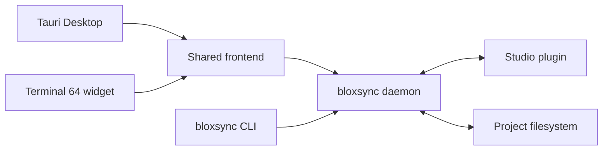

<h1 align="center">BloxSync</h1>

<p align="center">
  <strong>A Studio-authoritative Roblox sync engine for humans and coding agents.</strong><br />
  Studio is the only writer. Disk is a faithful, version-controlled mirror of the
  place — so a change is only real once it is in Studio, and the history is a
  record of what Studio actually contained.
</p>

<p align="center">
  
  
  
</p>

---

## What this fork changes

BloxSync is a modified fork of [**Ro Sync** by Pugbread](https://github.com/Pugbread/ro-sync).
All of the engine, protocol and tooling below is their work; this fork changes how
sync arbitrates and adds a history.

**Two-way sync makes desync structurally possible.** Both stores are writable, no
transaction spans them, and reconciliation has to arbitrate. Upstream fails closed
and parks an actionable conflict — including whenever it has no trustworthy baseline
for an existing file, which is every file after a daemon restart. That restart
conflict storm is the usual reason constant desync gets reported.

BloxSync removes the ambiguity instead of arbitrating it:

- **`syncMode: "mirror"`** makes Studio the only writer. `on_studio_push` never parks;
  `on_fs_change` never propagates. Conflicts are structurally impossible, so there is
  no prompt, because there is nothing to ask.
- **A disk edit is reverted, not ignored.** Ignoring would let the tree — and therefore
  the history — disagree with the place. The restore source is the last commit, which
  *is* Studio's content, so no round-trip to Studio is needed.
- **`gitHistory`** keeps a local git history of the mirror, committed on a debounce so
  one burst of editing is one commit rather than one commit per autosave.

`syncMode` defaults to `twoWay`, so upstream behaviour is unchanged unless you opt in.

> **Licence note.** Upstream ships no licence, so it is all-rights-reserved by default.
> This repository is a GitHub fork, which is what GitHub's terms permit. Do not
> redistribute it as an independent project unless upstream adds a licence.

---


<p align="center">
  <a href="#quick-start">Quick start</a> ·
  <a href="#the-agent-loop">Agent loop</a> ·
  <a href="#sync-model">Sync model</a> ·
  <a href="#capture">Capture</a> ·
  <a href="#playtests">Playtests</a> ·
  <a href="docs/client-commands.md">Command reference</a>
</p>

## One engine, three surfaces

The Studio plugin, wire protocol, and daemon are identical in every mode — the
desktop app and widget are views over the same engine, and a shared registry
keeps them from launching competing processes for one project.

| Surface | Best for |
| --- | --- |
| **Ro Sync Desktop** | A standalone control center with installers and signed auto-updates |
| **Terminal 64 widget** | Terminal-native project management and session spawning |
| **CLI only** | LLMs, automation, CI, and minimal installs — one binary plus the plugin |

## Highlights

- **LLM-first commands** — focused, JSON-friendly operations instead of a giant
  tool registry or opaque editor automation.
- **Live Studio truth** — query Models, Parts, UI, attributes, tags, selection,
  enums, and output through the connected plugin.
- **Safe filesystem sync** — only folders and Luau scripts round-trip; every
  other class stays Studio-authoritative. First-connect divergence always asks,
  and can transfer just the paths you choose.
- **Large-project bootstrap** — first connect is stats-first and streams
  source-free structure, script hashes, and Source parts in bounded,
  per-service chunks instead of building one place-sized JSON document. Wide
  filesystem event bursts reuse generation-fenced directory indexes rather
  than rescanning a 25,000-entry parent for every event.
- **Cross-project clipboard** — copy native instance trees from one connected
  project and paste them into another, references intact, one Undo.
- **Native capture** — render isolated models, exact camera views, transparent
  icons, or a single UI subtree with no screenshot permission needed.
- **Playtest agents** — run scripted playtests that stream events, probe UI,
  send input, and capture PlayServer or PlayClient contexts.
- **Lint parity** — `luau-lsp` with a live DataModel sourcemap plus `-O0/-O1/-O2`
  compiles to catch compiler-only failures.
- **Auditable mutation** — guarded writes, change-history waypoints, versioned
  workflows, and an append-only local write log.

## Quick start

### Desktop

Grab the installer for your platform from
[Releases](https://github.com/Pugbread/ro-sync/releases), or run from source:

```sh
git clone https://github.com/Pugbread/ro-sync.git
cd ro-sync/desktop && npm ci && npm run dev
```

In the app: **Settings → Studio plugin → Install**, restart Studio, pick a
**Projects folder**. Add existing folders from **Projects**, or click
**Connect → Create Project** in the Studio plugin and Ro Sync creates the
matching project and starts its daemon automatically. Desktop serves multiple
projects at once, each with an independent daemon and Studio connection.

### Terminal 64 widget

```sh
git clone https://github.com/Pugbread/ro-sync.git ~/.terminal64/widgets/ro-sync
```

Open Terminal 64, select Ro Sync, add a project folder, and flip its serving
switch. (Windows: clone to `%USERPROFILE%\.terminal64\widgets\ro-sync`.)

### CLI only

Download a platform bundle from
[Releases](https://github.com/Pugbread/ro-sync/releases), put `rosync` on your
`PATH`, then:

```sh
bloxsync plugin install
bloxsync init --project /path/to/game
bloxsync daemon start --project /path/to/game --raw
```

`bloxsync serve` keeps a foreground daemon for launchd, systemd, containers, or a
dev terminal.

## The agent loop

Discovery stays cheap and precise — read only what the task needs, write with
guardrails, verify what you touched:

```sh
bloxsync context --project .                                   # one compact environment read
bloxsync tree --project . --path ReplicatedStorage --depth 3   # inspect
bloxsync query --project . 'StarterGui/**/TextButton' --format paths

bloxsync set --project . --path Workspace/Camera \
  --prop FieldOfView --value 80 --waypoint "camera pass"     # guarded write, one Undo

bloxsync lint --project . --path ReplicatedStorage/Shared --summary
```

Move native content between two served projects without exporting a model:

```sh
bloxsync copy --project . Workspace/Map/Boss    # in the source project
bloxsync paste --project . --to Workspace/Imported    # in the destination
```

`bloxsync commands --compact` lists command families;
[docs/client-commands.md](docs/client-commands.md) is the full generated
reference. Versioned, assertion-checked multi-step workflows run through
`bloxsync run --file workflow.json`.

## Sync model

Ro Sync deliberately mirrors a narrow projection of the DataModel:

| On disk | In Studio | Direction |
| --- | --- | --- |
| `Foo.luau` | `ModuleScript` named `Foo` | Two-way |
| `Foo.server.luau` | `Script` named `Foo` | Two-way |
| `Foo.client.luau` | `LocalScript` named `Foo` | Two-way |
| `Folder/` | `Folder` | Two-way |
| Everything else (Parts, Models, UI, Remotes, …) | Studio instances | Studio-authoritative; inspect or mutate through the CLI |

Scripts with children use an `init (Name).*` file inside a matching directory;
duplicate sibling names get deterministic `[N]` suffixes; renames and moves stay
renames and reparents.

When both sides differ on first connect in `twoWay` mode, BloxSync always asks
before writing: **Keep Studio** does one clean Studio→disk overwrite, while
**Choose files** lets you move individual divergent paths into the Studio queue
and leaves the rest untouched.

In `mirror` mode there is no prompt. Studio is authoritative by definition, so
first connect — and every reconnect — is unconditionally that same clean
Studio→disk overwrite.

Protocol 6 keeps first-connect memory bounded for projects with tens of
thousands of instances. Structure requests contain at most 512 flat records
and 512 KiB of encoded JSON; comparison hashes use at most 64 records per
chunk, exact daemon-authored disk identities are returned in equally bounded
pages, and script Sources travel separately in validated parts. Names and disk
fragments are limited to 32 KiB, classes to 128 bytes, and retained encoded
structure to 64 MiB per service / 128 MiB per transfer. Sources are limited to
32 MiB per script, 64 MiB per service, and 128 MiB per transfer. The final
decision is constant-size: the widget opens from aggregate counts, pages
immutable stable-ID details in bounded responses, and submits selective IDs in
replay-safe chunks instead of posting a place-sized path array.

Live disk watching uses one no-follow, generation-fenced directory index per
stable parent for a debounced batch. A wide batch is therefore proportional to
the directory plus the events, rather than their product. Safe repeated events
are coalesced, and rename chains such as `A → B → C` retain identity as one
`A → C` operation. The watcher queue carries only bounded path metadata; Source
text is loaded through a stable no-follow read immediately before delivery, one
file at a time, with a 32-MiB limit. Raw filesystem ingress is nonblocking and
bounded to four metadata batches. Overflow, backend errors, rename cycles,
cross-boundary renames, swaps, competing destinations, oversized Sources, and
other ambiguous batches enter a generation-tagged quarantine and request one
explicit full resync. Recovery discards both raw and broadcast event tails
before reconnecting, so stale destructive operations cannot escape the barrier.

Studio→disk updates stage and revalidate each service before an atomic
service-directory swap with rollback backup. Those filesystem swaps are
per-service, so a failure in a later service does not undo an earlier successful
swap. Every failure after the live directory moves to backup takes an explicit
restore path. If a concurrent edit makes rollback unsafe, Ro Sync leaves the
edited live tree untouched, retains and audits the recovery backup, and returns
a terminal recovery-required receipt with ordered per-service restore/remove
instructions. The plugin surfaces that receipt and stops reconnecting rather
than replaying against uncertain disk state. Backups from completed transfers
are explicitly classified by an exact canonical name plus a bounded,
no-follow-validated completion marker, and retained for at most seven days and
32 transactions. Partial/recovery, lookalike, replaced, or unproven backups are
never automatically pruned.
Disk→Studio updates validate and stage every service before one cancelable
ChangeHistory recording applies the complete plan; any later failure rolls
back the whole Studio transaction, and one Studio Undo reverses a successful
pull. If both ChangeHistory cancellation and its single Undo fallback fail,
sync stops terminally instead of claiming a rollback. Selective pulls can also
remove only the authorized Studio-only generated paths. If Studio changes
during a guarded scan or transfer, bootstrap abandons the stale view and
restarts comparison.

## Capture

The packaged Photo engine needs no screenshot permission and no code inside the
game:

```sh
bloxsync capture photo --project . \
  --focus Workspace/Map/Boss --view isometric \
  --size 1024x1024 --background transparent \
  --output ./captures/boss.png --raw
```

Isolated captures tight-crop to the subject's alpha by default; `--camera-cframe`
reproduces an exact authored view and `--ui-target` isolates one UI subtree.
Camera, lighting, and UI state are restored after success or failure.

## Playtests

One command wraps the whole Studio playtest lifecycle: start, inject a
playscript, stream its events, print the result, stop.

```sh
bloxsync playtest run --project . \
  --script ./bench.server.luau \
  --client-script ./join.client.luau \
  --mode multiplayer --players 2 \
  --args '{"map":"Lighthouse","laps":3}' --raw
```

Playscripts get a `playtest.*` API for args, signals, progress events, and
completion; `--raw` streams live NDJSON with distinct exit codes per outcome.
See the [queue-and-lap benchmark](docs/examples/playtest-run/README.md) for a
complete example, or use the lower-level `playtest start/exec/ui/capture/stop`
commands for custom orchestration. Runtime changes never sync back to disk or
edit mode.

## Safety model

- Daemons are identified by canonical project path plus a fresh boot ID, and
  managed shutdown is authenticated — stale PID records are never trusted.
- Browser-backed clients need an allowlisted local origin and an owner
  capability; the desktop renderer has no unrestricted shell access.
- Raw `Parent` writes are refused (`bloxsync mv` instead), cross-service moves
  require `--force`, and every Studio write lands in an append-only local log.

Reporting and trust boundaries: [SECURITY.md](SECURITY.md).

## Architecture



Full component and lifecycle model: [docs/ARCHITECTURE.md](docs/ARCHITECTURE.md).

## Platforms

| Platform | Desktop | CLI / daemon | Terminal 64 | Studio plugin |
| --- | --- | --- | --- | --- |
| macOS Apple Silicon | ✅ | ✅ | ✅ | ✅ |
| Windows x86_64 | ✅ | CI-gated | Command-checked | ✅ |
| Linux x86_64 | Buildable | ✅ | ✅ | Studio is not native |

Release bundles include the checksum-pinned Luau compiler used by
`bloxsync lint`.

## Documentation

- [Command reference](docs/client-commands.md) — generated, machine-readable
- [Desktop install and release artifacts](docs/DESKTOP.md)
- [Architecture](docs/ARCHITECTURE.md)
- [Plugin protocol and schema](plugin/SCHEMA.md) · [plugin development](plugin/README.md)
- [Contributing](CONTRIBUTING.md) · [release verification](VERIFICATION.md)

Served projects also get generated `ro-sync.md`, `AGENTS.md`, `CLAUDE.md`, and
`.codex/config.toml` agent docs; refresh them after upgrades with
`bloxsync refresh --project .`.

## Development

```sh
cd daemon && cargo fmt --check && cargo test --locked \
  && cargo clippy --locked --all-targets -- -D warnings   # Rust gates
cd desktop && npm ci && npm run check                     # desktop host
node plugin/build-plugin.mjs                              # deterministic plugin build
```

CI mirrors these plus the frontend policy checks — see
[CONTRIBUTING.md](CONTRIBUTING.md).

---

<p align="center">
  Ro Sync is under active development. Protocol compatibility, deterministic
  artifacts, and safe local automation take priority over a broad sync surface.
</p>
